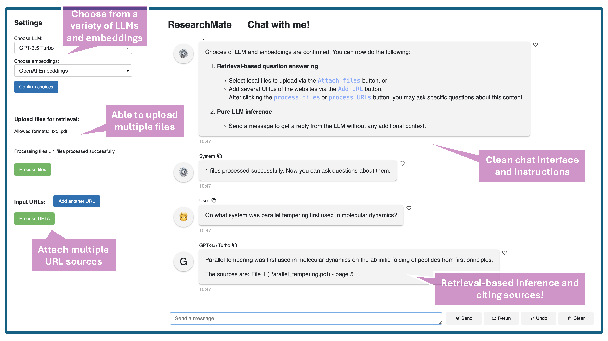

# ResearchMate

A tool combining the power of LLMs with real-time data retrieval to enhance research accuracy and relevance.

<p align="center">
  
</p>


### Features

1. **Retrieval-Augmented Generation (RAG)**: Combines LLM capabilities with real-time data retrieval to improve response accuracy.
2. **Support for Local Files and Web Sources**: Upload local files or retrieve content from the web for more targeted question answering.
3. **Source-Based Answers**: Generates responses that are grounded in the latest available data, ensuring relevance and factual accuracy.


---

## Installation

To run ResearchMate, you will need Python 3.x and the necessary libraries. Install the required libraries using the `requirements.txt` file located in the root directory:

```
pip install -r requirements.txt
```

Ensure that you have `panel` installed, which is the library used to serve the web app.

## Running the Web App

Once dependencies are installed, you can launch the ResearchMate app from the root directory by running the following command:

```
panel serve app.py --autoreload --show
```

This command will start the web application with live reloading and automatically open it in your browser.


## Motivation

In modern academic research, where information evolves rapidly, relying solely on pre-trained language models (LLMs) can lead to outdated or inaccurate results. New discoveries, datasets, and publications are constantly emerging, and pre-trained models may not reflect the most recent advancements.

Moreover, the vast diversity of fields and sub-fields in academia introduces a wide range of specialized jargon, terminology, and even domain-specific equations, which makes training LLMs across all areas challenging and often inefficient.

ResearchMate tackles these issues by leveraging retrieval-based augmentation (RAG). This hybrid approach combines the text generation power of LLMs with real-time data retrieval from external sources. The result is a more accurate and contextually relevant tool that grounds its answers in up-to-date information, catering to the specific needs of researchers across disciplines.

